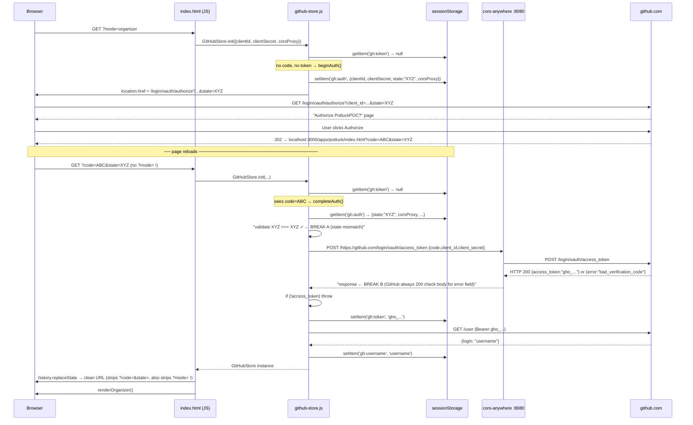

# PotluckApp — Design Spec

**Date:** 2026-03-21
**Status:** Approved

---

## Overview

A zero-backend library (`GitHubStore`) that abstracts GitHub as a shared datastore for small-group collaborative apps, plus a reference demo app (Potluck) built on top of it. No server, no database — GitHub is the persistence layer; the browser is the runtime.

The potluck use case (each participant submits a dish) is the first demo. The library is the real deliverable; other apps can be built on the same pattern.

---

## Project Structure

```
potluck_poc/
  lib/
    github-store.js        # The library — vanilla ES module, no build step
  apps/
    potluck/
      index.html           # Demo app — organizer + participant modes
  docs/
    superpowers/specs/     # Design documents
```

The potluck app imports the library directly via `<script type="module">` and a relative path. No bundler required for the POC. The library is intentionally kept as a single concrete file (Approach B) so real usage surfaces the right abstraction before a provider interface is extracted.

---

## GitHubStore Library API

```js
class GitHubStore {
  constructor({ clientId, clientSecret, token, repoFullName })
  //   clientId:     GitHub OAuth app client ID
  //   clientSecret: GitHub OAuth app client secret — EXPOSED IN CLIENT CODE [D1]
  //   token:        user's OAuth access token (set by init(); not passed directly by apps)
  //   repoFullName: "{owner}/{repo}" — optional at construction, required for data ops

  // Auth
  // beginAuth stores { clientId, clientSecret, state } in sessionStorage before redirecting.
  // clientSecret is stored so completeAuth() can retrieve it after the redirect.
  // clientSecret is not needed for the redirect itself, only for the token exchange.
  static beginAuth(clientId, clientSecret)     // redirects to GitHub OAuth

  // completeAuth reads clientId and clientSecret from sessionStorage (stored by beginAuth).
  // It takes no parameters — the values are always retrieved from sessionStorage.
  // ⚠ clientSecret is stored in sessionStorage and used here — see D1.
  static async completeAuth()                        // exchanges ?code= for token [D1][D2]

  static async init(config)                    // single entry point: handles full auth
                                               // lifecycle + sessionStorage rehydration
  get isAuthenticated()
  get username()                               // current user's GitHub login

  // Organizer: space setup
  async createSpace(name, { private: true })   // creates GitHub repo
                                               // → returns repoFullName ("{owner}/{repo}")
                                               // → also writes _event.json to repo root
  async addCollaborator(username)              // adds participant by GitHub username

  // Participant: join
  // join() uses TWO tokens:
  //   1. inviteToken (the organizer's Fine-Grained PAT from the URL) →
  //        PUT /repos/{owner}/{repo}/collaborators/{username}
  //   2. this.token (the participant's own OAuth token) →
  //        GET /user/repository_invitations → find matching invite →
  //        PATCH /user/repository_invitations/{id}  (auto-accept)
  // Step 2 is skipped when the PUT response body is empty — this signals the user
  // is already a collaborator and no invitation was created. A non-empty response
  // body (containing an invitee object) means an invitation was just created and
  // must be accepted. Do NOT use HTTP status code alone to discriminate: the API
  // returns 204 in both cases.
  async join(repoFullName, inviteToken)        // → void; idempotent

  // Data: write
  async write(path, data)                      // PUT — create or overwrite a JSON file
  // append() always writes to {prefix}/{iso-timestamp}.json.
  // In the potluck app, prefix is always store.username.
  // prefix is a parameter (not hardcoded to username) so other apps can write
  // to arbitrary namespaces — but readAll() assumes top-level directories
  // correspond to participant usernames, so apps should follow that convention.
  async append(data, { prefix })               // PUT — write {prefix}/{iso-timestamp}.json

  // Data: read
  async read(path)                             // GET — returns parsed JSON or null
  // list() returns all files under the given prefix path.
  // Entries are sorted lexicographically by path (ISO timestamp names sort correctly).
  async list(prefix)                           // GET — returns [{ path, sha }], sorted

  // readAll() enumerates top-level directories in the repo, skipping any entry
  // whose name starts with "_" (reserved for library metadata: _event.json etc.).
  // For each participant directory, it calls list(username) and read()s every entry.
  // Polling is the app's responsibility — readAll() is a plain async call with no
  // built-in interval. Apps use setInterval(() => store.readAll(), 30_000).
  async readAll()                              // GET — returns participant array (see below)
}
```

`GitHubStore.init()` is the standard entry point for apps. It handles:
1. If `?code=` is in the URL → `completeAuth()`, clean URL, store token in `sessionStorage`
2. If token is in `sessionStorage` → rehydrate, return ready instance
3. Otherwise → `beginAuth()`, redirect to GitHub

---

## Auth Flow

```
App calls GitHubStore.init()
  → stores { clientId, clientSecret, state } in sessionStorage
  → redirects to github.com/login/oauth/authorize?scope=repo&state=...

GitHub redirects back with ?code=&state=
  → app validates state (CSRF)
  → POSTs to github.com/login/oauth/access_token via CORS proxy [D2]
  → stores token in sessionStorage (not localStorage — not persisted across sessions)
  → returns ready GitHubStore instance
```

### Auth Sequence Diagram



**BREAK A — State mismatch:** `completeAuth()` reads `stored.state` from `sessionStorage['gh:auth']`.
If `beginAuth()` was called more than once before the callback arrived (e.g. two tabs, a refresh,
or the user navigated away and back), the stored state is from the _last_ call, not the one GitHub
echoed back. The check at `github-store.js:31` throws `'State mismatch — possible CSRF'`.
The `?code=` URL stays unclean. Next navigation to `?mode=organizer` triggers a new `beginAuth()` →
another redirect to GitHub → GitHub increments its reauth counter → eventually: "unusually high
number of requests".

**BREAK B — Silent token-exchange failure:** GitHub's `/login/oauth/access_token` always returns
HTTP 200, even on error. A bad code returns `{"error":"bad_verification_code","error_description":"…"}`,
not an HTTP error. The `resp.ok` check at `github-store.js:46` passes; the
`if (!access_token)` check at `github-store.js:48` catches it, but the thrown message only says
"no access_token in response" — it does not include the `error` or `error_description` fields
from GitHub's body.

Participants may sign up for GitHub using Google OAuth (github.com login page supports it), reducing the "I don't have a GitHub account" barrier.

---

## Data Model

```
{owner}/{repo}/
  _event.json                              # library metadata — skipped by readAll()
  {username}/
    {iso-timestamp}.json                   # one file per submission (append-only)
```

**Participant directory convention:** any top-level directory whose name does **not** start with `_` is treated as a participant namespace by `readAll()`. Library-reserved files and directories must use the `_` prefix (`_event.json`, etc.). App-level metadata files should follow the same convention.

**`_event.json` schema:**
```json
{ "name": "potluck-2026-03-21", "created": "2026-03-21T12:00:00.000Z", "owner": "johndoe" }
```
Written by `createSpace()`. Read by the organizer app to display event info on resume.

Example layout:
```
johndoe/potluck-2026-03-21/
  _event.json
  bob/
    2026-03-21T14:30:00.000Z.json
    2026-03-21T15:05:00.000Z.json          # latest = current answer
  anna/
    2026-03-21T14:55:00.000Z.json
```

**Every write is append-only at the storage level.** Apps derive current state by taking the lexicographically last file per participant (ISO timestamp filenames sort correctly). CRUD semantics are available via `write()` to a fixed path — the library doesn't enforce one model over the other.

**File content:** raw JSON, no envelope. Schema is the app's concern.

**`readAll()` return shape:**
```js
[
  {
    username: "bob",
    entries: [
      { path: "bob/2026-03-21T14:30:00.000Z.json", data: { dish: "lasagna" } },
      { path: "bob/2026-03-21T15:05:00.000Z.json", data: { dish: "tiramisu" } }
    ],
    latest: { dish: "tiramisu" }   // === entries[entries.length - 1].data
  },
  {
    username: "tom",
    entries: [],                   // participant directory exists but no files yet
    latest: null                   // null when entries is empty
  }
]
```

---

## State Persistence

| Layer | What | Survives tab close |
|---|---|---|
| `sessionStorage` | OAuth token | No (intentional) |
| `localStorage` | `potluck:recentRepos` — `[{ repoFullName }]` | Yes |
| Repo (`_event.json`) | Event name, created date, owner username | Always — source of truth |

On organizer app load: checks `localStorage` for recent repos → shows "Continue: potluck-2026-03-21" one-click restore. Organizer can also enter a repo name manually.

On participant app load: join URL (`?mode=participant&repo=...&invite=...`) is self-contained and idempotent — if the participant is already a collaborator, `PUT /collaborators/{username}` returns an empty response body (no invitation created), and the auto-accept step is skipped.

---

## Organizer Flow

1. Open `index.html?mode=organizer` → OAuth if needed
2. Fill in event name → `store.createSpace(name)` → private GitHub repo created
3. App deep-links to GitHub PAT creation page with inline instructions [D3]
4. Organizer creates Fine-Grained PAT: scoped to this repo, `administration:write` permission
5. Organizer pastes PAT into app → app generates join URL:
   `index.html?mode=participant&repo={owner}/{repo}&invite={PAT}`
6. Organizer copies and shares join URL with participants (one URL for all)
7. App polls `store.readAll()` every 30s → live submissions table
8. On return: `localStorage` shows recent repos → one click to resume

---

## Participant Flow

1. Open join URL (`?mode=participant&repo=...&invite=...`) → OAuth if needed
2. `store.join()` fires automatically on load:
   - Uses embedded invite PAT to `PUT /repos/.../collaborators/{username}`
   - Uses participant's own token to `PATCH /user/repository_invitations/{id}` (auto-accept)
3. Participant fills in form: dish + optional note
4. Submit → `store.append({ dish, note }, { prefix: username })`
   → writes `{username}/{timestamp}.json`
5. Confirmation + history shown; resubmit updates current answer (new log entry)
6. On return: `localStorage` restores repo context; invite param is optional after first join

---

## Potluck UI

**Organizer mode:**
```
┌─────────────────────────────────────────┐
│  Potluck Organizer                      │
│  Signed in as: johndoe                  │
│                                         │
│  [Create new event]                     │
│  Event name: [potluck-2026-03-21    ]   │
│  [Create]                               │
│                                         │
│  ── or resume ──────────────────────    │
│  > potluck-2026-03-21  (3 responses)    │
│                                         │
│  ── active event ───────────────────    │
│  Repo: johndoe/potluck-2026-03-21       │
│                                         │
│  Join link:                             │
│  Step 1: Create invite token [→ GitHub] │
│  Step 2: Paste token: [______________]  │
│  Step 3: [Copy join link]               │
│                                         │
│  ── responses (live, refreshes 30s) ─   │
│  bob     tiramisu        15:05          │
│  anna     green salad     14:55         │
│  tom      —               (pending)     │
└─────────────────────────────────────────┘
```

**Participant mode:**
```
┌─────────────────────────────────────────┐
│  Potluck — johndoe/potluck-2026-03-21   │
│  Signed in as: bob                      │
│  Status: joined ✓                       │
│                                         │
│  What are you bringing?                 │
│  Dish:  [_____________________________] │
│  Note:  [_____________________________] │
│  [Submit]                               │
│                                         │
│  ── your history ───────────────────    │
│  14:30  lasagna                         │
│  15:05  tiramisu  ← current             │
└─────────────────────────────────────────┘
```

No CSS framework. Plain styles, mobile-readable. Organizer "→ GitHub" link deep-links to PAT creation with pre-filled instructions.

---

## Deferred Items

These are known issues intentionally deferred from the MVP. They should be addressed before any real (non-POC) use.

| # | Item | Risk | Recommended Fix |
|---|---|---|---|
| D1 | `client_secret` exposed in client-side code | Anyone can impersonate the OAuth app | Replace with GitHub Device Flow, or move token exchange to Cloudflare Worker |
| D2 | Token exchange proxied via public CORS proxy (`cors-anywhere`) | Proxy sees token exchange; uptime not guaranteed | Replace with own Cloudflare Worker |
| D3 | Invite token (Fine-Grained PAT) created manually by organizer | Organizer friction; requires visiting GitHub Settings | Extend D2 Worker to handle `PUT /collaborators` on behalf of organizer |
| D4 | Invite PAT embedded in participant URL | Anyone with the link can self-add as collaborator | Intentional magic-link model for MVP; mitigate by revoking PAT after signup window |

**D1 + D2 + D3 collapse into a single small Cloudflare Worker** — the recommended post-MVP path. The Worker handles: (a) OAuth token exchange (fixing D1/D2), (b) collaborator addition using a stored organizer token (fixing D3).

**Account requirements by role:**

| Role | MVP | Hardened (with Worker) |
|---|---|---|
| Participant | GitHub account | GitHub account |
| Organizer | GitHub account | GitHub account |
| App operator (one-time deploy) | GitHub account (OAuth app registration) | GitHub account + Cloudflare account |

The Cloudflare account is an **infrastructure concern for the app operator only** — the person who deploys the Worker once. Organizers and participants never interact with Cloudflare. This is analogous to needing an AWS account to host an app without requiring users to have AWS accounts.

---

## Out of Scope (MVP)

- Multiple simultaneous events per organizer (localStorage supports it; UI shows one at a time)
- Participant removal / repo cleanup
- Real-time updates (polling at 30s is sufficient)
- Provider abstraction layer (extract after potluck app proves the interface)
- Any UI beyond functional / readable
